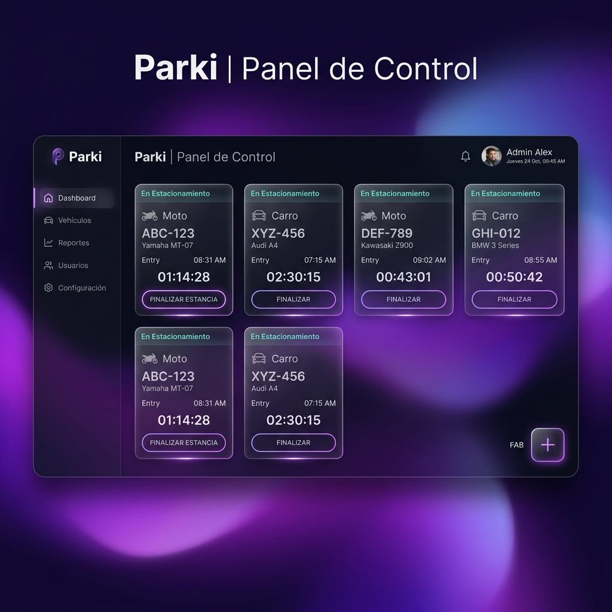

# Parki | Parking Management App

**Enlace de Producción:** [https://parki-app-2026.web.app](https://parki-app-2026.web.app)

Parki es una aplicación web moderna y minimalista diseñada para la gestión de estacionamientos. Utiliza un diseño de alta fidelidad, "glassmorphism", y animaciones fluidas para ofrecer una experiencia de usuario premium.

## Características Implementadas

- **Diseño Premium y Minimalista:** Interfaz de usuario de alta calidad con fondos oscuros, gradientes modernos y efectos de cristal (glassmorphism) utilizando Tailwind CSS.
- **Micro-interacciones Fluidas:** Animaciones integradas con Framer Motion para transiciones suaves y respuestas visuales interactivas.
- **Gestión Vehicular en Tiempo Real:** Registro rápido de vehículos (Carros y Motos) con validación automática de placas.
- **Temporizador e Historial:** Visualización en tiempo real del tiempo transcurrido desde el ingreso del vehículo y cálculo automático del costo de la tarifa al finalizar con base en el tipo de vehículo.
- **Historial Completo:** Vista de registros pasados con datos persistidos de forma segura.
- **Testing:** Configuración de Vitest para asegurar el funcionamiento óptimo de la gestión de estado de los vehículos en la tienda (`Zustand`).
- **Despliegue Automático:** Despliegue implementado a través de Firebase Hosting en entorno de producción.

## Tecnologías Utilizadas

- **React 19 + TypeScript**
- **Vite** para build y tooling
- **Zustand** para la gestión global del estado
- **Tailwind CSS v4** + component system inspirado en Shadcn UI
- **Framer Motion** para micro-animaciones
- **Vitest** para pruebas unitarias
- **Firebase Hosting**

## Scripts Disponibles

- `npm run dev`: Inicia el servidor de desarrollo local.
- `npm run build`: Compila los componentes para producción.
- `npm run test`: Ejecuta los tests unitarios.
- `npm run preview`: Previsualiza la build de producción.
